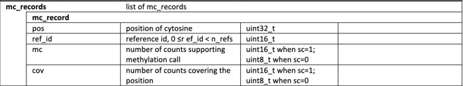
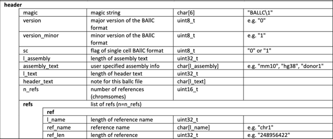

# BAllC-JS
Welcome to the BAllC-JS. 

This project provides a Javascript tool to read and query the BAllC files. 
The original C++ BAllC project is available [here](https://github.com/jksr/ballcools).


## Install

    $ npm install --save @jiawei_s/ballc

## Usage

### Importing the module
```javascript
import {BAllC} from '@jiawei_s/ballc';
```

### BAllC constructor with local files
After imported the BAllC package, you can build the new BAllC instance with a BAllC file(.ballc) path 
and an optional index file(.bci) path, if the index file path is not provided 
we are using BAllC file path + '.bci' as the index file path.

**The BAllC file must be indexed!** Whether or not you provide the index file path!

```javascript
//if the index file(.bci) path is not provided, it will be default by filePath + '.bci'
const testBallc = new BAllC(filePath);
// or 
const testBallc = new BAllC(filePath, indexPath);
```

### BAllC constructor with remote files

To do...

### BAllC functions
#### query
```javascript
    //In Class function, chrRange example: "chr1:0-100000"
    async query(chrRange)

    //Usage, the mc_records is an array of objects [Object, ...], the range format: "chr{chrName}:{start}-{end}"
    const mc_records = await testBallc.query(range);
```
Here's the [doc](https://github.com/jksr/ballcools/blob/main/doc/ballc_spec.pdf) for the mc_records. 


#### getHeader
```javascript
    //In Class function
    async getHeader()

    //Usage, the header is an array of objects [Object, ...]
    const header = await testBallc.getHeader();
```
Here's the [doc](https://github.com/jksr/ballcools/blob/main/doc/ballc_spec.pdf) for the header.


### Some utility functions
Here are some functions that you may find them helpful, but they are not in the BAllC class.
#### VirtualOffset
```javascript
//This Class initiate the vitual offset of the bgzf file format. 
class VirtualOffset(blockAddress, blockOffset)
```
For the virtual offset of bgzf file, you can find details [here](https://biopython.org/docs/1.75/api/Bio.bgzf.html)

#### ChrRange
```javascript
//This Class initiate the query range. chrRange: "chr{chrName}:{start}-{end}"
class ChrRange(chrRange)
```

#### reg_to_bin
```javascript
//An utility function in bgzf
function reg_to_bin(beg, end)
```
You can find reg_to_bin function [here](https://samtools.github.io/hts-specs/tabix.pdf)

#### queryBGZFIndex and queryBAIIC
```javascript
//This is the function that reads the bgzf index.
async function queryBGZFIndex(filePath, chrRange, ref_id)
//This is the core function that search the target query range in the index file(.bci)
function queryBAIIC(chrRange, hexString, refID)
```

#### queryChunk
```javascript
//This is the core function that queries the chunks after we convert the virtual offsets to the offsets in the .ballc file.
async function queryChunk(fileHandle, blockAddress ,startOffset, endOffset)
```

### BAllC file samples
We also provided some BAllC samples for the test usages. You can download the samples [here](https://wangftp.wustl.edu/~dli/ballc/ballc/).
